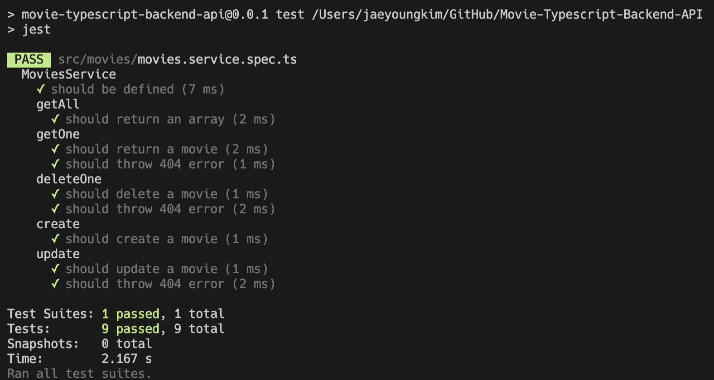
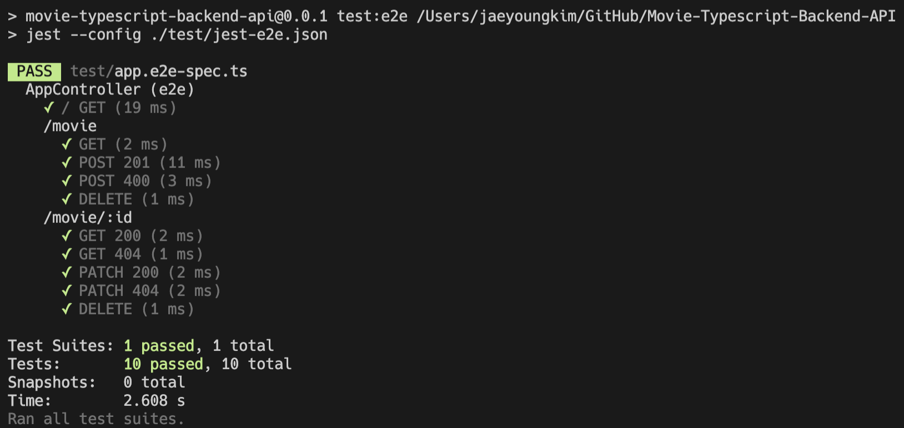

<h1 align="center">Welcome to Movie Backend API 👋</h1>

## What project is it?

> This application is a back-end API created with NestJS to manage movie lists. You can create, read, update or delete (CRUD) movies to the list.

## What is NestJS?

> NestJS is for the server side and can be used to build efficient, reliable and scalable web applications for the enterprise.

## Languages and tools

<p align="left">  <a href="https://nestjs.com/" target="_blank">  </a><a href="https://nodejs.org" target="_blank">  </a> <a href="https://www.typescriptlang.org/" target="_blank">  </a> <a href="https://jestjs.io" target="_blank">  </a><a href="https://git-scm.com/" target="_blank">  </a> </p>

## Installation

```bash
$ npm install
```

## Running the app

```bash
$ npm run start
```

## Test

> How to run Unit tests

```bash
$ npm run test
```

> Unit test completed.



> How to run e2e tests

```bash
$ npm run test:e2e
```

> E2E test completed.



## Author

👤 **Jaeyoung Kim**

- Website: https://www.jaeyoungkim.ca/
- Github: [@jaeyoung-kim-dev](https://github.com/jaeyoung-kim-dev)
- LinkedIn: [@jaeyoung-kim-dev](https://www.linkedin.com/in/jaeyoung-kim-dev/)
- Medium(Blog): [@jaeyoung-kim-dev](https://jaeyoung-kim-dev.medium.com/)
- Email: jaeyong.kim.dev@gmail.com
